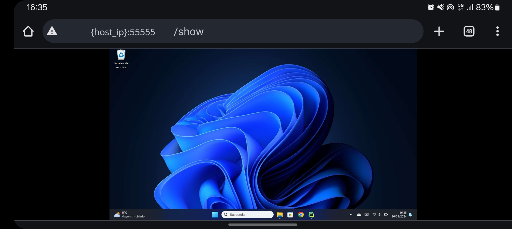

> **Note:** The trademarks and copyrights of third parties that appear in these images, including the icons of PyCharm, Chrome, Microsoft Files, and Microsoft Store, are the property of their respective owners. Their use here is for illustrative purposes only and does not imply endorsement or affiliation with Xenun Technologies.

> XenunCloudPC(Beta) version 0.0(Beta)


# XenunCloudPC(Beta) 🖥️☁️ 


**XenunCloudPC(Beta)** is an innovative application developed by **Xenun**. Our goal is to reimagine existing tools and adapt them for various contexts, allowing access to your computer from any device—be it a computer, mobile phone, tablet, or TV—via the internet.

This tool is crafted using HTML, Python, JavaScript, and CSS.

## 🔒 Security
Despite the fact that this application requires authentication, **this Beta version does not support HTTPS, so the connection is not encrypted and completely secure**. We strongly recommend using it only on your local network or areas where you trust completely.

## 🌍 Access from Any Device
The idea is to enable access to your computer from your local network via a web navigator without the need to install an application on the accessing device. While you can use any device with a web browser to harness the power of a PC, this feature is especially potent when used through a mobile phone. This transforms your mobile phone into a fully functional computer. Furthermore, connecting peripherals such as a keyboard, mouse, and a larger screen to your mobile can significantly enhance the experience.

## 🚀 Getting Started
Follow these steps to get **XenunCloudPC(Beta)** up and running on your device (Note: although we are working on a version for linux systems, this application has currently tested only on Windows):

**Recommendations**: If you want to use the application for connecting to your computer without having to execute it every time, you should configure your computer to prevent the screen from turning off and to avoid entering suspend mode. Otherwise, if one of these things happens, you will not be able to connect to it.

### Step 1: Preparation
Download the complete zip archive from GitHub and extract it to a preferred directory.

### Step 2: Install Python
If you don't have Python installed on your device, download the latest version for Windows from the [official Python website](https://www.python.org).

### Step 3: Install Dependencies
Navigate to the extracted folder in the command prompt where `requirements.txt` is located, and run:
```bash
pip install -r requirements.txt
```
This command installs all the necessary dependencies for CloudPC.

### Step 4: Start the Server
Before running the script, **we remember you that the connectios doesn't support HTTPS, this mean the connection isn't encipted and completely secure**.

Execute the `CloudPC.py` script by typing:
```bash
python CloudPC.py
```
This will start the server, allowing you to access your computer from your local network. To access the login page, use the URL shown in your command prompt output, typically: "[http://{host_ip}:55555](http://{host_ip}:55555)" where host_ip is your computer's IP address and 55555 is the default port (modifiable in serverConfig.txt).

### Step 5: Changing Default Credentials
For security, change the default login credentials (`user` and `password`). Navigate to: "[http://{host_ip}:55555/credentials](http://{host_ip}:55555/credentials)" and follow the prompts to update your username and password.

You can also close all active sessions by entering your credentials in the login form and clicking `Log out all sessions` button.

### Step 6: Adjusting Frame Quality and Update Rate
If you experience slowness, adjust the frame quality and update rate at: "[http://{host_ip}:55555/config](http://{host_ip}:55555/config)". The frame quality can range from 1 to 100, and the frame update interval can be set from 0.001 to 1 second.

By default, this are 60 and 1 second respectively.

## 📜 Licenses of Third-Party Libraries

This project utilizes several open-source libraries, each under its own license:

- **Python (Python Software Foundation License Version 2)** - See `thirdPartyLicenses/python_license.txt`

- **Flask (BSD-3-Clause)** - See `thirdPartyLicenses/flask_license.txt`
- **PyAutoGUI (BSD)** - See `thirdPartyLicenses/pyautogui_license.txt`
- **Flask-SocketIO (MIT)** - See `thirdPartyLicenses/flask_socketio_license.txt`
- **gevent (MIT)** - See `thirdPartyLicenses/gevent_license.txt`
- **bcrypt (Apache-2.0)** - See `thirdPartyLicenses/bcrypt_license.txt`

Complete texts of these licenses are available in the `thirdPartyLicenses` directory.

## 📄 Copyright Notice

This project is protected under "All rights reserved". The source code may not be modified or redistributed without explicit permission from the author.

For more information see the LICENSE archive.

## Disclaimer

**XenunCloudPC(Beta)** is provided as-is without any warranty of any kind, either express or implied. The developers of **Xenun** make no representations or warranties regarding the security, reliability, or use of the application. 

While **Xenun** facilitates remote desktop access, it does not collect or transmit user data to its developers. Users are solely responsible for the security of their own computer systems and the protection of their data when using **Xenun**. Users should ensure that their network and access settings are securely configured, especially when accessing over public or unsecured networks.

In no event will the developers of **Xenun** be liable for any unauthorized access to, alteration of, or the deletion, destruction, damage, or loss of, any data, computer systems, or networks used in connection with **XenunCloudPC**. Users are encouraged to implement robust security measures and seek professional advice appropriate for their circumstances.

This project was created by Marcos Zúñiga Ituarte.
